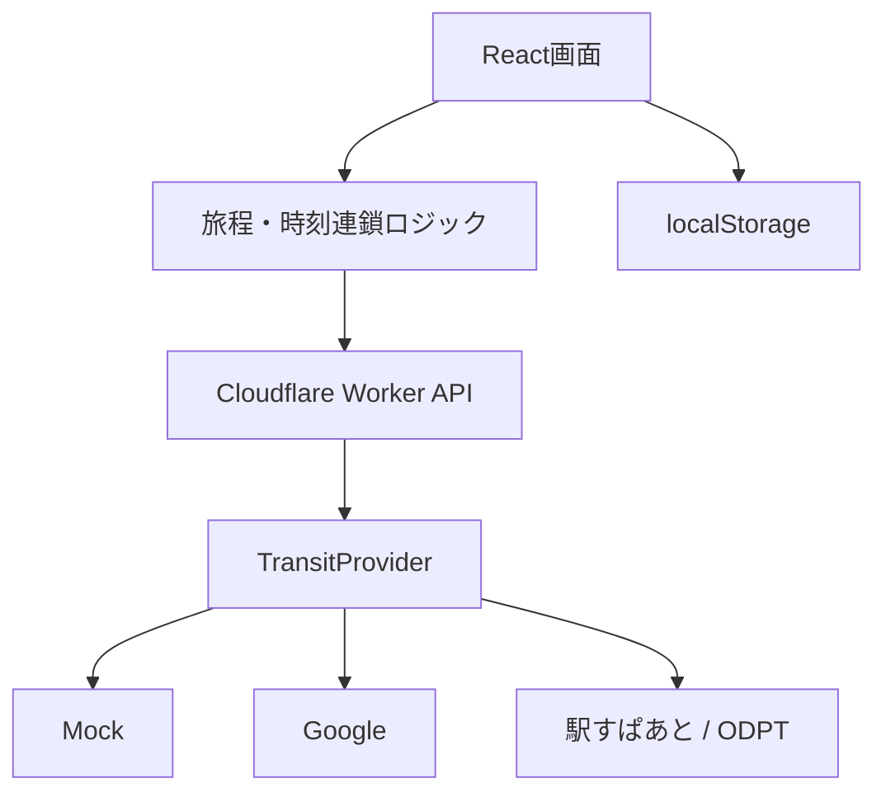

# 鉄道路線プランナー（仮称）大まかな設計書

- 作成日: 2026-08-27
- 想定利用者: 個人利用（日本国内の鉄道旅行を計画する人）
- 想定端末: Windows PC / iPad / iPhone
- 想定公開先: GitHub + Cloudflare Workers
- 開発方針: まずAPIキー不要のデモ版を完成させ、交通データ提供元を後から差し替える

## 1. このシステムで実現したいこと

一般的な乗換案内は、出発駅と到着駅から「おすすめ経路」を自動で決める。一方、このシステムでは利用者自身が駅を好きな順番で並べ、通りたい経路や立ち寄りたい場所を含む一日の鉄道プランを組み立てる。

たとえば、次のような計画を作れるようにする。

> 名古屋 → 大阪難波 → 吉野 → 名古屋

各駅では「何分滞在するか」を設定でき、その時間を考慮して次の列車候補を表示する。途中の便を変更した場合は、その後の区間だけを再計算する。

## 2. 設計上の重要な判断

### 2.1 「時刻表」の意味

初期版で扱う時刻表は、駅に停車する全列車を並べた完全な駅時刻表ではなく、次の内容とする。

- 指定した区間の列車・経路候補
- 各候補の出発時刻と到着時刻
- 乗換駅、路線名、列車名・行先（取得できる場合）
- 前後または代替となる便の候補

駅の完全な時刻表は、利用する交通APIによっては取得できないため、第2段階以降の追加機能とする。

### 2.2 最初から全国の時刻表データを自前で持たない

鉄道ダイヤは改正・臨時列車・運休などで更新される。全国分を収集・維持する仕組みは本体より大きな開発になるため、アプリ本体は外部の交通データを共通形式へ変換して利用する。

画面や旅程計算は `TransitProvider` という共通インターフェースだけを見る。Google、駅すぱあと、ODPT/GTFSなどは、その裏側で差し替えられる構造にする。

### 2.3 初期版は地図よりも時刻の流れを優先する

地理的な地図は見栄えがよいが、API・地図タイル・ライセンス対応が増える。MVPでは、駅と列車を縦につないだタイムラインを主画面にする。地図表示は第2段階とする。

## 3. MVPの範囲

### 必ず作る機能

1. 旅行日と出発時刻の指定
2. 駅名の検索と選択
3. 出発駅・経由駅・到着駅の追加
4. 駅の削除
5. ドラッグ操作または上下ボタンによる駅順の変更
6. 各途中駅で必要な時間（乗換余裕・観光時間）の指定
7. 隣り合う駅ごとの経路・時刻候補表示
8. 使用する便の選択
9. 選択変更後の後続区間再計算
10. 接続できない区間の警告
11. 合計所要時間・乗換回数・概算運賃の表示
12. 入力したプランの端末内保存と再読込
13. APIキーなしでも動くデモモード
14. PC・タブレット・スマートフォン対応

### MVPでは作らない機能

- 会員登録・ログイン
- 複数端末間の同期
- 決済・予約・切符購入
- リアルタイム遅延を考慮した自動変更
- 全国の完全な駅時刻表
- 地理的な路線地図
- 複数日の旅程
- 最安経路や最短経路の高度な自動最適化
- Webサイトからの時刻表スクレイピング

## 4. 主な利用の流れ

1. 利用者が旅行日と出発時刻を入力する。
2. 「駅を追加」で、名古屋・大阪難波・吉野などを順番に追加する。
3. 必要に応じて駅カードをドラッグし、順番を変更する。
4. 途中駅ごとに「この駅で必要な時間」を設定する。初期値は10分、観光する場合は90分などに変更できる。
5. 「時刻を検索」を押す。
6. 各区間に最大4件程度の経路候補が表示される。
7. 利用者が乗りたい便を選ぶ。
8. 便を変えた場合、その区間より後ろだけを再計算する。
9. 完成した旅程を名前を付けて端末内へ保存する。

## 5. 画面構成

### 5.1 PC・タブレット

| 領域 | 内容 |
| --- | --- |
| 上部 | アプリ名、プラン名、保存、読込、新規作成 |
| 左側 | 日付・出発時刻、駅リスト、滞在時間、駅の追加・並べ替え、検索ボタン |
| 右側上部 | 出発・到着・合計時間・運賃・乗換回数の概要 |
| 右側中央 | 駅と区間を縦につないだ時刻タイムライン |
| 右側下部 | 選択中の区間の代替候補と詳細 |

### 5.2 スマートフォン

- 上から「旅行設定」「駅の並び」「検索結果」の1列表示にする。
- ドラッグしにくい場合に備え、各駅に上移動・下移動ボタンも付ける。
- 区間詳細はアコーディオンで開閉する。
- 主要ボタンの高さは44px以上とする。

### 5.3 表示例

```text
08:00  名古屋
        │ JR東海道本線 / 新幹線など
10:05  大阪難波
        ├ この駅で90分
11:35  大阪難波 発
        │ 近鉄線
13:10  吉野
```

実装時は文字だけの線ではなく、色付きの縦線・駅丸・カードで表現する。

## 6. 機能要件

| ID | 要件 | MVP |
| --- | --- | --- |
| FR-01 | 旅行日と出発時刻を設定できる | 必須 |
| FR-02 | 入力中の駅名を候補表示できる | 必須 |
| FR-03 | 同名駅は都道府県・事業者等で区別できる | 必須 |
| FR-04 | 2〜10駅を追加・削除・並べ替えできる | 必須 |
| FR-05 | 途中駅ごとに0〜1440分の必要時間を設定できる | 必須 |
| FR-06 | 隣接する駅を1区間として交通経路を検索できる | 必須 |
| FR-07 | 各区間に複数候補を表示し、1件を選べる | 必須 |
| FR-08 | 手動選択した候補は勝手に別の便へ変更しない | 必須 |
| FR-09 | 上流変更時、未固定の後続区間だけ再検索する | 必須 |
| FR-10 | 接続時間不足、経路なし、API失敗を区別して表示する | 必須 |
| FR-11 | 合計時間、移動時間、駅滞在時間、乗換回数、運賃を集計する | 必須 |
| FR-12 | 運賃が取得できない場合は「情報なし」と表示する | 必須 |
| FR-13 | 入力した旅程を localStorage に保存できる | 必須 |
| FR-14 | データ確認日時と「公式情報も確認」の注意を表示する | 必須 |
| FR-15 | 駅の完全な時刻表を開ける | 将来 |
| FR-16 | 地図上に経路を描画する | 将来 |
| FR-17 | URLで旅程を共有する | 将来 |
| FR-18 | D1などへ保存し複数端末で同期する | 将来 |

## 7. 時刻の連鎖計算

### 7.1 基本ルール

- 最初の区間は、利用者が指定した出発日時以降で検索する。
- 次の区間の検索可能時刻は、直前区間の到着時刻に、その駅で必要な時間を加えた時刻とする。
- 必要時間の初期値は10分とする。
- 日をまたぐ場合もISO日時で保持し、表示だけを日本時間に変換する。
- アプリ全体の表示タイムゾーンは `Asia/Tokyo` とする。

### 7.2 再計算のルール

```text
readyAt = 利用者が入力した出発日時

各区間について順番に:
  1. readyAt以降に出発する候補を検索
  2. 自動選択区間なら最初の候補を選択
  3. 手動固定区間なら、その候補がreadyAt以降か確認
  4. 接続可能なら次のreadyAtを計算
     readyAt = 到着時刻 + 次駅で必要な時間
  5. 接続不能な固定区間は赤い警告にし、勝手に変更しない
```

### 7.3 競合と通信の扱い

- 再検索中に駅順や時刻が再度変わった場合、古い検索結果を画面へ反映しない。
- `AbortController` または検索世代IDを使って古いリクエストを無効化する。
- 途中区間のAPIが失敗しても、前区間までの結果は残す。
- 再試行ボタンは失敗区間単位で設ける。

## 8. データモデル案

```ts
export type Station = {
  id: string;
  name: string;
  secondaryText?: string;
  latitude?: number;
  longitude?: number;
  providerRef: string;
};

export type StopPlan = {
  id: string;
  station: Station;
  stayMinutes: number;
  memo?: string;
};

export type Itinerary = {
  id: string;
  title: string;
  travelDate: string;       // YYYY-MM-DD
  departureTime: string;    // HH:mm
  timeZone: "Asia/Tokyo";
  stops: StopPlan[];
  legs: LegPlan[];
  updatedAt: string;
};

export type LegPlan = {
  id: string;
  fromStopId: string;
  toStopId: string;
  status: "idle" | "loading" | "ready" | "conflict" | "error";
  candidates: RouteCandidate[];
  selectedCandidateId?: string;
  isLocked: boolean;
  errorCode?: "NO_ROUTE" | "MISSED_CONNECTION" | "PROVIDER_ERROR";
};

export type RouteCandidate = {
  id: string;
  departureAt: string;
  arrivalAt: string;
  durationMinutes: number;
  transferCount: number;
  fareYen: number | null;
  segments: TransitSegment[];
  source: "mock" | "google" | "ekispert" | "odpt";
  fetchedAt: string;
};

export type TransitSegment = {
  mode: "WALK" | "RAIL" | "SUBWAY" | "BUS" | "OTHER";
  lineName?: string;
  trainName?: string;
  headsign?: string;
  fromName: string;
  toName: string;
  departureAt: string;
  arrivalAt: string;
  stopCount?: number;
  color?: string;
  encodedPolyline?: string;
};
```

### 保存対象

端末内へ長期保存するのは、プラン名、日付、駅順、必要時間、メモなど利用者が入力した内容を中心とする。外部APIの検索結果は時刻変更や利用条件の問題があるため、恒久保存せず、プランを開いた際に再検索する。

## 9. API設計案

### `GET /api/health`

現在のデータ提供モードと利用可能機能を返す。

```json
{
  "ok": true,
  "provider": "mock",
  "capabilities": {
    "stationSearch": true,
    "routeSchedules": true,
    "fullStationTimetable": false
  }
}
```

### `POST /api/stations/search`

```json
{
  "query": "名古",
  "sessionToken": "optional-uuid"
}
```

返却値は `Station[]`。入力は2文字以上、300ms程度のデバウンスを行う。

### `POST /api/routes/search`

```json
{
  "from": { "providerRef": "...", "name": "名古屋" },
  "to": { "providerRef": "...", "name": "大阪難波" },
  "departureAt": "2026-09-01T08:00:00+09:00",
  "preferences": {
    "fewerTransfers": false,
    "lessWalking": false,
    "railOnly": true
  }
}
```

返却値は正規化済みの `RouteCandidate[]`。上限は4件程度とする。

### 将来: `POST /api/timetables/station`

完全な駅時刻表を提供できるプロバイダーを導入した場合のみ有効にする。未対応時は曖昧な空配列ではなく `501 NOT_IMPLEMENTED_FOR_PROVIDER` を返す。

## 10. プロバイダー境界

```ts
export interface TransitProvider {
  readonly name: string;
  readonly capabilities: {
    stationSearch: boolean;
    routeSchedules: boolean;
    fullStationTimetable: boolean;
    multiViaSearch: boolean;
  };

  searchStations(query: string, sessionToken?: string): Promise<Station[]>;
  searchRoutes(input: {
    from: Station;
    to: Station;
    departureAt: string;
    preferences: RoutePreferences;
  }): Promise<RouteCandidate[]>;
}
```

プロバイダー固有のレスポンスをReactコンポーネントへ直接渡さない。必ずWorker側で共通データモデルへ変換する。

## 11. 推奨技術構成

| 層 | 採用候補 | 理由 |
| --- | --- | --- |
| フロントエンド | React + TypeScript + Vite | 画面操作が多く、Cloudflareへ載せやすい |
| API | Cloudflare Worker + Hono | APIキーを隠しつつ、静的画面と同じ場所で運用できる |
| 入力検証 | Zod | 外部APIへ送る値を安全に制限できる |
| 並べ替え | dnd-kit | マウス・タッチの両方に対応しやすい |
| 状態管理 | ZustandまたはuseReducer | 駅順と区間結果の更新を一元管理する |
| 日時 | date-fns + date-fns-tz等 | 日本時間とISO日時を明示的に扱う |
| テスト | Vitest + React Testing Library | 時刻連鎖ロジックを単体テストできる |
| 保存 | localStorage | 初期版はログイン・DB不要 |
| 将来の同期 | Cloudflare D1 | 必要になった時だけ追加する |

## 12. 全体構成



## 13. 交通データ提供元の比較

| 候補 | 初期開発 | 得意なこと | 主な制約 | 推奨用途 |
| --- | --- | --- | --- | --- |
| MockProvider | 無料・登録不要 | UIと計算ロジックの確認 | 実際の時刻ではない | 最初に必ず実装 |
| Google Places + Routes | API設定と請求設定が必要 | 駅検索、区間経路、出発・到着時刻、代替経路 | Transitは中間経由地非対応。駅の完全時刻表ではない | 個人向けMVPの実データ候補 |
| 駅すぱあと API | 評価版・契約を確認 | 日本の駅・経路・ダイヤ・時刻表、複数経由地 | フリープランではダイヤ探索・時刻表が不足し、有料契約が必要 | 国内向け完成版の有力候補 |
| ODPT / GTFS-JP + 経路探索エンジン | データ利用は比較的始めやすいが構築量が多い | 公開されている地域の時刻表・リアルタイム情報 | データセットごとに範囲・更新・利用条件が異なる | 対応地域を限定した無料版 |

### 初期版の推奨順序

1. `MockProvider` で全画面と時刻連鎖ロジックを完成させる。
2. `GoogleProvider` を追加し、駅検索と区間ごとの実時刻を表示する。
3. 「駅に停車する全列車の時刻表」が本当に必要なら、駅すぱあと APIの契約条件を確認するか、対象地域を限定してODPT/GTFSを追加する。

Google Routes APIのTransit検索は中間経由地を受け付けないため、駅A→駅B、駅B→駅Cのように区間ごとに検索する。これはこのアプリの「自分で駅順を組む」設計とも相性がよい。

## 14. セキュリティと利用条件

- Google等のAPIキーはブラウザへ渡さず、Cloudflare WorkerのSecretとして保存する。
- `.env`、`.dev.vars`、実キーをGitへコミットしない。
- 駅数は最大10、検索文字列は100文字以内など、Worker側でも入力検証する。
- 1回の操作で同じ検索を大量送信しないよう、デバウンス・キャッシュ・レート制限を設ける。
- 外部APIのレスポンスを恒久的な自前時刻表として蓄積しない。
- WebサイトのHTMLを無断でスクレイピングして時刻表を集めない。
- 運賃がAPIから返らない場合、推測値を事実のように表示しない。
- 画面にデータ取得時刻と、実際の運行は交通事業者の公式情報で確認する旨を表示する。

## 15. エラー表示

| 状態 | 利用者向け表示 |
| --- | --- |
| 駅が見つからない | 「駅名を確認するか、都道府県名も入力してください」 |
| 経路なし | 「この時刻以降の経路が見つかりませんでした」 |
| 接続時間不足 | 「前の列車の到着後、この便には間に合いません」 |
| APIキー未設定 | 「デモデータで表示しています」 |
| API利用上限 | 「交通データの取得上限に達しました。時間を置いて再試行してください」 |
| 一時的な通信失敗 | 「この区間だけ再試行」ボタンを表示 |
| 運賃なし | 「運賃情報なし」と表示し、合計を「一部未取得」にする |

## 16. テストすべき中心ロジック

1. 3駅を並べると2区間が生成される。
2. 駅順を変更すると区間の組み合わせが正しく作り直される。
3. 1区間目の到着時刻と途中駅の必要時間から、2区間目の検索開始時刻が正しく決まる。
4. 手動固定した便に間に合わない場合、便を勝手に変えず競合表示になる。
5. 未固定の後続区間だけが再検索される。
6. 深夜0時をまたいでも日付が正しく進む。
7. 運賃の一部が `null` の時、合計が確定額として表示されない。
8. 保存後に再読込すると駅順・日付・滞在時間が戻る。
9. 外部API固有のJSONが正規化モデルへ正しく変換される。
10. 古い非同期検索結果が新しいプランを上書きしない。

## 17. MVPの完成条件

- APIキーがなくても、デモモードで駅追加から旅程完成まで操作できる。
- 2〜10駅を追加・削除・並べ替えできる。
- 出発時刻と途中駅の必要時間に従い、全区間の時刻がつながる。
- 各区間で候補を変更でき、後続区間へ影響が反映される。
- 接続不能を明確に表示する。
- リロード後も入力プランが残る。
- 390px幅とPC幅の両方で操作できる。
- APIキーがクライアントのJavaScriptやGit履歴へ含まれない。
- `npm run build`、型チェック、中心ロジックのテストが成功する。

## 18. 開発段階

### Phase 1: デモ版

- 画面、駅並べ替え、時刻連鎖、候補選択、競合表示、端末内保存
- MockProvider
- GitHubへ保存

### Phase 2: 実時刻版

- Google Places / Routesなど、選定したAPIをWorker経由で接続
- API失敗処理、利用量制限、データ確認時刻
- 必要であればCloudflareへ公開

### Phase 3: 拡張版

- 完全な駅時刻表
- 地図表示
- URL共有
- 複数日
- ログイン・D1同期
- 運行情報・遅延情報

## 19. 実装時に決める項目

次の項目は、デモ版を触ってから決めればよい。

- 「この駅で必要な時間」の初期値を5分・10分・15分のどれにするか
- 駅数上限を10件より増やすか
- バス・徒歩・飛行機・フェリーも含めるか
- Googleと駅すぱあとのどちらを本番データにするか
- 完全な駅時刻表が本当に必要か
- 地図をどの段階で追加するか

## 20. 参考にした公式情報

- [Google Routes API: Transit route](https://developers.google.com/maps/documentation/routes/transit-route)
  - Transitは中間経由地を指定できない。
  - 出発時刻または到着時刻を指定できる。
  - 現在基準で過去7日〜未来100日の範囲。
  - 最大3件の追加経路を返せる場合がある。
- [Google Places API: Place Types](https://developers.google.com/maps/documentation/places/web-service/place-types)
  - `train_station`、`subway_station`、`transit_station` 等で駅候補を絞り込める。
- [駅すぱあと API: 経路探索](https://docs.ekispert.com/v1/api/search/course/extreme.html)
  - 日付・時刻・探索種別を指定でき、`viaList` は複数指定可能。
- [駅すぱあと API: プラン・料金体系](https://api-info.ekispert.com/plan/)
  - フリープランは平均待ち時間探索のみで、ダイヤ探索や時刻表用途には制限がある。
- [公共交通オープンデータ協議会](https://www.odpt.org/)
  - 無料の利用者登録後、公開データを利用できる。各データの利用条件確認が必要。
- [国土交通省: GTFS-JP](https://www.mlit.go.jp/sogoseisaku/transport/sosei_transport_tk_000067.html)
  - 駅、時刻表、運賃などを扱う標準形式の資料が公開されている。

